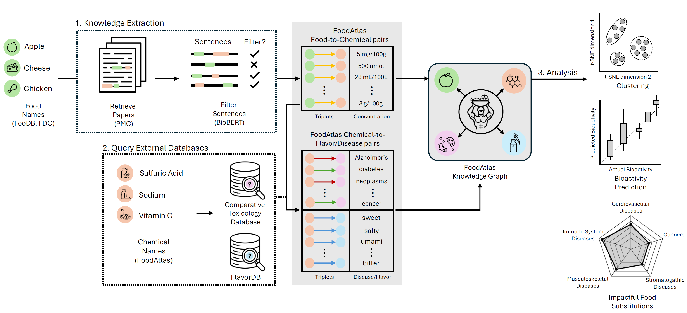

# Note: FoodAtlas has been migrated to [here](https://github.com/AI-Institute-Food-Systems/foodatlas)!

# FoodAtlas
FoodAtlas is an open-source pipeline for building a high-quality knowledge graph (KG) that links foods, chemicals, diseases, and supporting metadata drawn from the scientific literature and public databases. Large language models extract candidate relationships, while curation code standardises entities, resolves synonyms, and fuses records from resources such as FoodOn, FooDB, ChEBI, PubChem, MeSH, CTD, and the FoodData Central (FDC) dataset. The resulting KG powers the public [FoodAtlas web experience](https://www.foodatlas.ai/) and continues to expand as new literature is processed.

FoodAtlas-KGv2 focuses on reproducible KG construction. It houses the transformation logic, data preparation scripts, and post-processing utilities that back the hosted demo, enabling other researchers to rebuild, audit, or extend the KG.



## Directories
- [`data`](./data): Source datasets and ontologies used to seed the KG. Run `./data/download.sh` to retrieve the public portions; some folders act as placeholders for restricted datasets you must supply separately.
- [`food_atlas`](./food_atlas): Python package containing the KG data model, preprocessing utilities, ontology loaders, and post-processing jobs (`kg/`, `data_processing/`, `utils/`, `hotfixes/`, `additional_analysis/`).
- [`outputs`](./outputs): Workspace for generated lookup tables, metadata, triplets, cache files, and final KG exports. The `0_run_kg_init.sh` script seeds this directory.
- [`scripts`](./scripts): Orchestrated CLI wrappers for the major pipeline stages (initialisation, metadata parsing, KG expansion, and post-processing). Edit the path variables inside each script before running.
- [`logs`](./logs): Example log output and templates for long-running jobs.
- [`requirements.txt`](./requirements.txt) & [`pyproject.toml`](./pyproject.toml): Python dependencies and linting configuration.

## Getting Started
The pipeline is routinely exercised on Ubuntu 22.04 with Python 3.11. The steps below assume a Conda-based workflow; feel free to adapt them to your environment management tool of choice.

### Clone the repository
```console
git clone https://github.com/IBPA/FoodAtlas-KGv2.git
cd FoodAtlas-KGv2
```

### Create and activate a Conda environment
```console
conda create -n foodatlas python=3.11
conda activate foodatlas
```
You can leave the environment at any point with `conda deactivate`.

### Install Python dependencies
```console
pip install -r requirements.txt
```

### Download reference data
Many of the scripts expect the curated resources in `data/`. Retrieve the public datasets with:
```console
cd data
./download.sh
cd ..
```
Review `data/README.md` for notes on additional data sources that cannot be redistributed and must be added manually.

### Configure API keys and paths

Create a `food_atlas/kg/api_key.txt` file containing your NCBI API key. It should look like:
```
your@email.com
your_ncbi_api_key
```

### Run the data processing pipeline
```
./scripts/00_run_data_processing.sh
```

### Prepare the base knowledge graph files
Initialise the KG workspace (lookup tables, seed entities, and merged reference data) with:
```console
./scripts/0_run_kg_init.sh
```
This populates `outputs/kg/` with the canonical TSV files that subsequent stages modify.

### Process LLM-generated metadata
Point the metadata processing script at the raw model output you wish to parse. Update the `PATH_INPUT` and `PATH_OUTPUT_DIR` variables in `scripts/1_run_metadata_processing.sh`, or call the module directly:
```console
python -m food_atlas.kg.run_metadata_processing \
    path/to/raw_metadata.pkl \
    outputs/kg/2025_01_01 \
    --model-name gpt-4
```
The command standardises chemical names and concentrations, performs exact-match linking against the seeded lookup tables, and produces `_metadata_new.tsv` plus a diagnostic `_tuples_not_parsed.tsv` in the output directory.

### Expand the knowledge graph
Feed the processed metadata into the KG expansion script to create new nodes and edges:
```console
python -m food_atlas.kg.run_kg_expansion \
    outputs/kg/2025_01_01/_metadata_new.tsv \
    --path-input-kg outputs/kg \
    --path-output-dir outputs/kg
```
By default, `scripts/2_run_adding_triplets_from_metadata.sh` wraps this step and then executes `python -m food_atlas.tests.test_kg outputs/kg` to sanity-check the resulting KG.

### Post-process and enrich KG entities
Apply optional quality-improvement passes (grouping foods/chemicals, harmonising labels, etc.) with:
```console
./scripts/3_run_postprocessing.sh
```
Inspect `food_atlas/kg/postprocessing/` for additional jobs you can enable or customise.

### (Optional) Run tests directly
To validate a KG directory without the wrapper script, run:
```console
python -m food_atlas.tests.test_kg outputs/kg
```

## Authors
- Fangzhou Li — Graduate Student<sup>1,3,4</sup>
- Jason Youn — Graduate Student<sup>1,3,4</sup>
- Kaichi Xie — Graduate Student<sup>1,3,4</sup>
- Trevor Chan — Graduate Student<sup>1,3,4</sup>
- Pranav Gupta — Graduate Student<sup>1,3,4</sup>
- Arielle Yoo — Graduate Student<sup>1,2,4</sup>
- Michael Gunning — Graduate Student<sup>1,3,4</sup>
- Keer Ni — Graduate Student<sup>1,3,4</sup>
- Ilias Tagkopoulos — Principal Investigator<sup>1,3,4</sup>

<sup>1</sup> Department of Computer Science, University of California at Davis
<sup>2</sup> Department of Biomedical Engineering, University of California at Davis
<sup>3</sup> Genome Center, University of California at Davis
<sup>4</sup> USDA/NSF AI Institute for Next Generation Food Systems (AIFS)

## Contact
Questions, bug reports, and collaboration ideas are welcome at Fangzhou Li (`fzli@ucdavis.edu`) or Prof. Ilias Tagkopoulos (`itagkopoulos@ucdavis.edu`).

## Citation
If you use FoodAtlas or build upon the KG in your research, please cite:
```bibtex
@article{li2026unified,
  title={A unified knowledge graph linking foodomics to chemical-disease networks and flavor profiles},
  author={Li, Fangzhou and Youn, Jason and Xie, Kaichi and Chan, Trevor and Gupta, Pranav and Yoo, Arielle and Gunning, Michael and Ni, Keer and Tagkopoulos, Ilias},
  journal={npj Science of Food},
  year={2026},
  publisher={Nature Publishing Group UK London}
}

@article{youn2024foodatlas,
  title={FoodAtlas: automated knowledge extraction of food and chemicals from literature},
  author={Youn, Jason and Li, Fangzhou and Simmons, Gabriel and Kim, Shanghyeon and Tagkopoulos, Ilias},
  journal={Computers in Biology and Medicine},
  volume={181},
  pages={109072},
  year={2024},
  publisher={Elsevier}
}
```

## License
FoodAtlas-KGv2 is released under the Apache-2.0 License. See [`LICENSE`](./LICENSE) for the full text and usage terms.


## Funding
This work is supported by the USDA-NIFA AI Institute for Next Generation Food Systems (AIFS), USDA-NIFA award number 2020-67021-32855.
